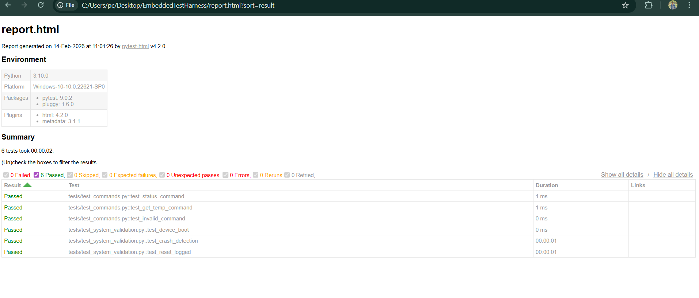
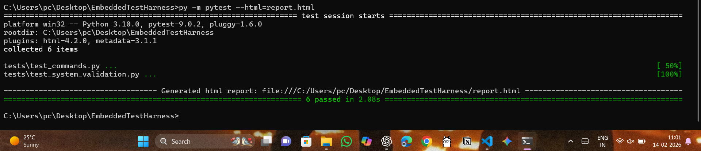

# EmbeddedTestHarness
Project --- "Embedded Firmware Validation & Low-Level System Test Automation Framework (Python + PyTest)"

## 📌 Overview

EmbeddedTestHarness is a Python-based embedded firmware validation and low-level system test automation framework.  

This project simulates an embedded device firmware and performs automated validation using PyTest. It demonstrates system-level testing, crash detection, log-based failure analysis, and structured test automation.
---
Description

Embedded firmware test harness simulating command-response validation, crash detection, and log-based system verification using PyTest automation.
---

## 🎯 Objective

To simulate real-world embedded software validation by:

- Testing firmware command-response behavior
- Detecting crash conditions
- Validating system reset functionality
- Performing log-based failure analysis
- Automating test execution and reporting

---
## 🏗 Project Architecture

```
EmbeddedTestHarness/
│
├── device/
│   └── firmware_simulator.py
│
├── logs/
│   └── device.log
│
├── utils/
│   └── log_validator.py
│
├── tests/
│   ├── test_commands.py
│   └── test_system_validation.py
│
└── requirements.txt
```

---

## 🔧 Features

- Embedded firmware simulation
- Command-response validation (STATUS, RESET, GET_TEMP, CRASH, etc.)
- Crash detection and memory error simulation
- Log-based validation using keyword detection
- Automated test execution using PyTest
- HTML report generation
- Structured test harness architecture

---

## 🧪 Test Coverage

### Functional Testing
- Command validation
- Invalid command handling
- Response verification

### System-Level Validation
- Boot validation
- Crash detection
- Reset logging verification
- Warning and error detection from logs

---

## 🚀 How to Run

### 1️⃣ Install dependencies

bash
pip install -r requirements.txt

## 2️⃣ Run tests
python -m pytest --html=report.html

## 3️⃣ View report
Open report.html in your browser.


## 🛠 Technologies Used
- Python 3.x
- PyTest
- pytest-html
- Python logging module

---

## 🧠 Engineering Concepts Demonstrated

- Embedded system simulation
- Low-level system validation
- Log-based failure detection
- Automation framework design
- Structured test case implementation
- Debugging logging conflicts in test environments

---

## 📈 Sample Output
After execution:
6 passed in 2.08s



An HTML test report is generated summarizing all test cases.

## 🔍 Future Enhancements
- Add performance testing (response time validation)
- Integrate CI/CD using GitHub Action.
- Add parameterized test cases
- Expand command coverage
- Simulate hardware communication (UART mock)


## 👨‍💻 Author Nikhil Lingala 

Developed as a demonstration of embedded firmware validation and automation testing principles.
