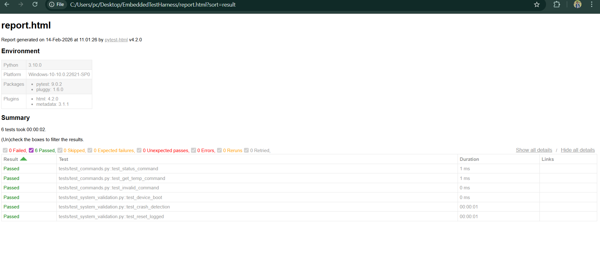
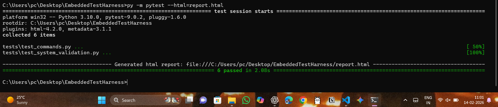

# 🚀 EmbeddedTestHarness

<div align="center">
  <p><strong>Embedded Firmware Validation & Low-Level System Test Automation Framework</strong></p>
  
  
  
</div>

---

## 📌 Overview

**EmbeddedTestHarness** is a robust, Python-based test automation framework designed specifically for embedded firmware validation and low-level system testing.

This project simulates embedded device firmware to perform comprehensive automated validation using **PyTest**. It serves as a practical demonstration of system-level testing, crash detection, log-based failure analysis, and structured test automation methodologies.

> **Core Concept:** A simulated embedded firmware test harness capable of command-response validation, anomaly/crash detection, and log-based system verification.

---

## 🎯 Objective

To faithfully simulate real-world embedded software validation by:
- ✅ **Testing** firmware command-response behavior under various conditions.
- ✅ **Detecting** simulated hardware crashes and memory faults.
- ✅ **Validating** system reset and recovery functionality.
- ✅ **Performing** log-based failure analysis using keyword detection.
- ✅ **Automating** test execution, assertions, and reporting for continuous integration readiness.

---

## 🏗 Project Architecture

A clean, modular architecture separating the device simulator, testing framework, and utilities:

```text
EmbeddedTestHarness/
├── device/
│   └── firmware_simulator.py      # Core firmware state machine & simulation logic
├── logs/
│   └── device.log                 # Generated system logs for validation
├── utils/
│   └── log_validator.py           # Utility for parsing and validating log output
├── tests/
│   ├── test_commands.py           # Unit tests for command-response validation
│   └── test_system_validation.py  # Integration tests for system states & crash detection
├── README.md                      # Project documentation
└── requirements.txt               # Project dependencies
```

---

## 🔧 Core Features

- **Embedded Firmware Simulation:** Accurately mimics device states, boot sequences, and operational modes.
- **Command-Response Validation:** Automated checks for commands like `STATUS`, `RESET`, `GET_TEMP`, `CRASH`, etc.
- **Crash & Anomaly Detection:** Simulates memory errors and validates the system's ability to catch and log them.
- **Log-Based Verification:** Analyzes `device.log` to confirm the presence of expected initialization, warning, and error events.
- **Automated Execution & Reporting:** Leverages PyTest to run suites and generate detailed HTML reports.

---

## 🧪 Test Coverage

### Functional Testing
- Command validation (validating expected outputs)
- Invalid command handling (ensuring robust error responses)
- Response verification and state transitions

### System-Level Validation
- Boot sequence validation
- Crash and fault detection
- Reset and recovery logging verification
- Warning and critical error detection from system logs

---

## 🚀 Getting Started

Follow these steps to set up the environment and run the test harness locally.

### 1️⃣ Install Dependencies

Ensure you have Python 3.x installed, then run:

```bash
pip install -r requirements.txt
```

### 2️⃣ Run the Test Suite

Execute the tests and generate an HTML report using PyTest:

```bash
python -m pytest --html=report.html
```

### 3️⃣ View the Test Report

Open the generated `report.html` in your preferred web browser to view the detailed test results.



---

## 📈 Sample Output

A successful test run will typically result in output similar to the following, alongside the generated HTML report summarizing all executed test cases.

```text
6 passed in 2.08s
```



---

## 🛠 Technologies & Libraries

- **Python 3.x:** Core programming language.
- **PyTest:** Primary testing framework.
- **pytest-html:** Plugin for HTML report generation.
- **Python `logging`:** Standard library module for log generation and parsing.

---

## 🧠 Engineering Concepts Demonstrated

- Embedded system simulation techniques
- Low-level system validation strategies
- Log-based failure detection and parsing
- Scalable automation framework design
- Structured test case implementation (Arrange, Act, Assert)
- Managing and debugging logging conflicts in automated test environments

---

## 🔍 Future Enhancements

- [ ] **Performance Testing:** Add response time validation and latency checks.
- [ ] **CI/CD Integration:** Integrate with GitHub Actions for automated testing on push/pull requests.
- [ ] **Data-Driven Testing:** Implement parameterized test cases for broader input coverage.
- [ ] **Expanded Command Set:** Increase firmware command coverage to include edge cases.
- [ ] **Hardware Mocking:** Simulate lower-level hardware communication protocols (e.g., UART/I2C mocks).

---

## 👨‍💻 Author

**Nikhil Lingala**
*Developed as a comprehensive demonstration of embedded firmware validation and automation testing principles.*
